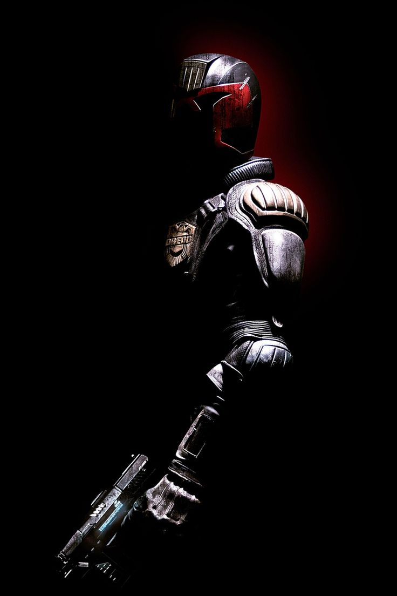

# 📋 Trabajo Práctico N°5 - Bootstrap


## 📝 Descripción
Este repositorio contiene la solución completa del **Trabajo Práctico N°5 (TP05) - 2025** de la asignatura *Laboratorio de Programación* de la Universidad Nacional de la Patagonia Austral, correspondiente a las carreras de Analista de Sistemas y Licenciatura en Sistemas. El TP05 se centra en el uso de Bootstrap para desarrollar páginas web responsivas, abarcando los siguientes ejercicios:

- **Punto 1**: Creación de una planificación diaria en `planificacion.html` (con contenedor) y `planificacion-fluid.html` (con contenedor fluido).
- **Punto 2**: Diseño de un formulario de registro responsivo en `registro.html`.
- **Punto 3**: Desarrollo de un archivo `index.html` con header, body (con tarjetas enlazando a las páginas anteriores) y footer.

## 📂 Estructura del Repositorio
- `planificacion.html`: Página con una planificación diaria usando un contenedor Bootstrap estándar.
- `planificacion-fluid.html`: Versión alternativa con un contenedor fluido para la misma planificación.
- `registro.html`: Formulario de registro con campos para nombre, correo, contraseña, género, país y aceptación de términos.
- `index.html`: Página principal con un header, dos tarjetas que enlazan a `planificacion.html` y `registro.html`, y un footer fijo.
- `static/img/`: Carpeta con imágenes utilizadas en las tarjetas (`planificacion.png` y `formulario.png`).

## 📋 Instrucciones de Uso
1. Clona el repositorio en tu máquina local:
   ```bash
   git clone https://github.com/nicobutter/ldp_tp05_bootstrap.git
   ```
2. Abre los archivos HTML en un navegador web.
3. Aseguráte de tener conexión a internet para cargar los recursos de Bootstrap desde el CDN.
4. Para editar, usa un editor de texto como VS Code.

## ⚙️ Requisitos
- Navegador web con soporte para HTML5 y CSS3.
- Conexión a internet para los archivos CDN de Bootstrap.

## 📌 Notas Adicionales
- Reemplaza las rutas de las imágenes (`static/img/planificacion.png`, `static/img/formulario.png`) con las ubicaciones correctas si las tienes en otro directorio.
- Ajusta los enlaces en `index.html` (`planificacion.html` y `registro.html`) si los archivos están en subdirectorios.
- Si necesitas agregar más funcionalidades o imágenes, consulta la documentación oficial de [Bootstrap](https://getbootstrap.com/).

## 🤝 Contribuciones
Cualquier sugerencia o mejora es bienvenida. Por favor, crea un issue o envía un pull request con tus cambios.

## 📧 Contacto y Creador
- **Creador**: Nicolás Butterfield
- **Correo**: [nicobutter@gmail.com](mailto:nicobutter@gmail.com)

## 🕹️ Bonus Track

<p align="center">
  <br>
  <strong>"Judge Dredd."</strong><br>
  <em>– Javik, Mass Effect 3</em>
</p>